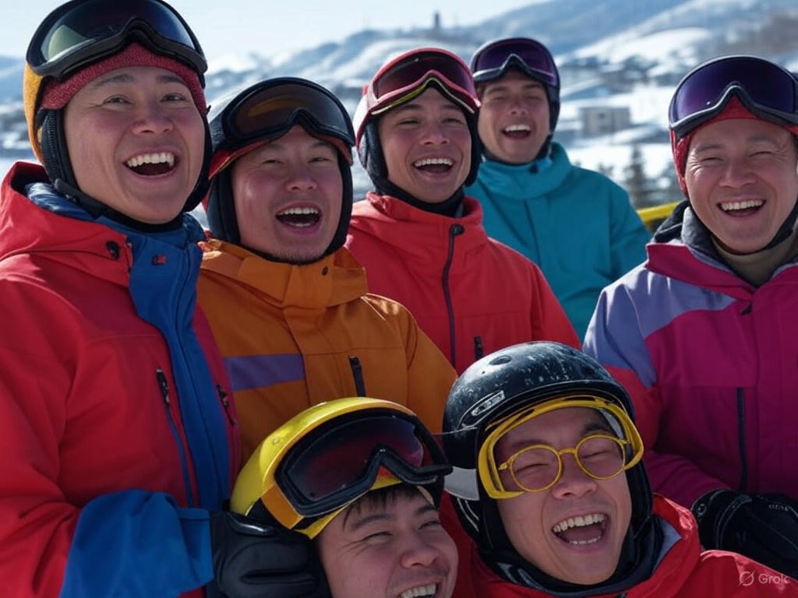
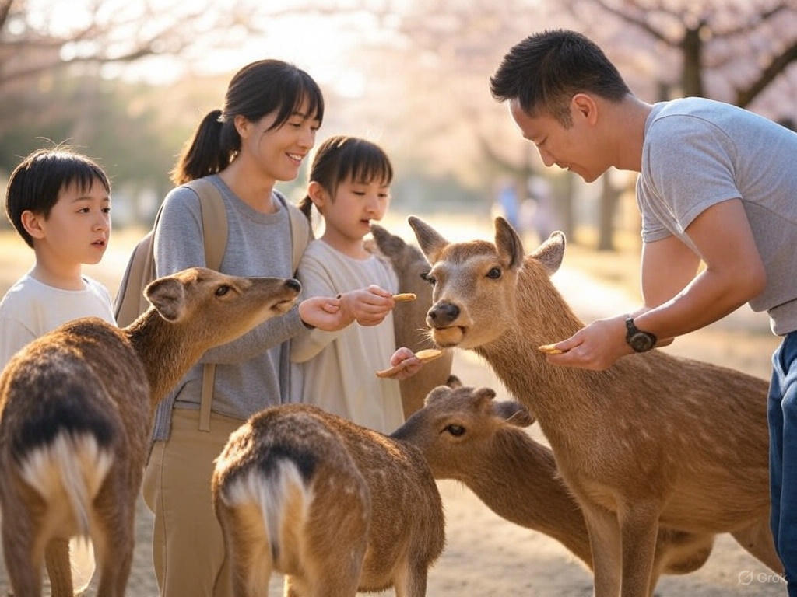
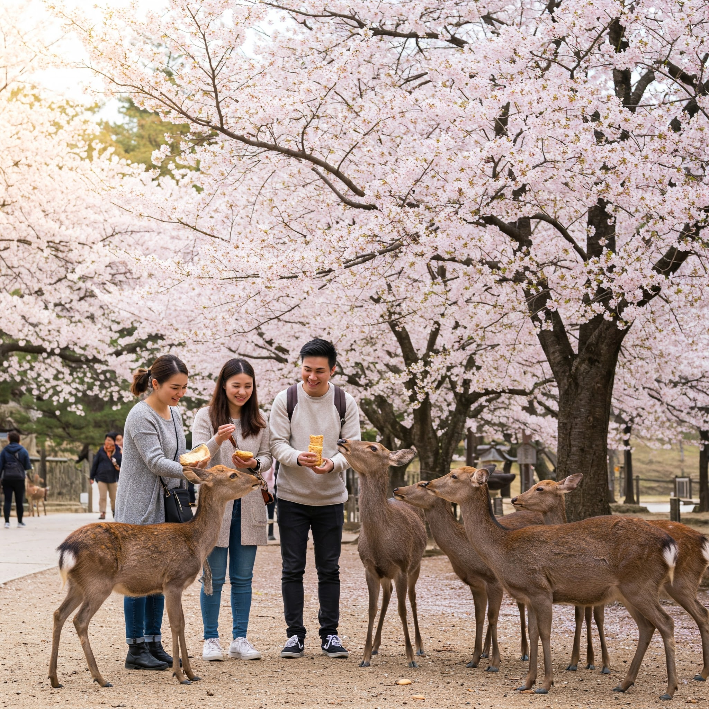

# Theory 2

## 2.1 Ethics

Models such as GPT-4, Stable Diffusion, and Copilot are impressive in their
ability to generate realistic images but have limitations. These models require
an extensive amount of training data that can be difficult to obtain and may
not fully represent the complexity of the world we live in. Therefore, they may
generate images that are visually convincing but contain inaccuracies or incon-
sistencies with reality.

While these models are undeniably useful for certain purposes, it is essential
to remember that they have limitations. The models should not be solely relied
upon as a complete representation of reality. It is necessary to consider their
constraints and limitations while using them for practical applications. There-
fore, performing a thorough analysis and validation before implementing these
models in real-world scenarios is crucial. By doing so, we can ensure that these
models are helping us to achieve our goals without compromising their reliabil-
ity and accuracy.

Here, you will use any of the generative image LLMs (GPT-4, Copilot, Gem-
ini, etc.) to generate pictures of humans in real-life scenarios. The main goal is
that you asses the images generated (at least 5) and carefully check for incon-
sistencies.

Present your findings (writing) with examples (optional). You should be
able to find one inconsistency with reality and present that, explaining why you
think it happened.

Hint: Check their body composition!

### Background

### Answer

|Prompt|Grok|Gemini|Findings|
|-|-|-|-|
|Generate an image of a small group of friends skiing at niseko village in japan|||XXX|
|Generate an image of a family on holiday  at nara park in osaka feeding the deer with biscuits during sakura season|||XXX|
|Generate a person walking down arashiyama bamboo forest using a Fujifilm camera to take a photo|||XXX|

