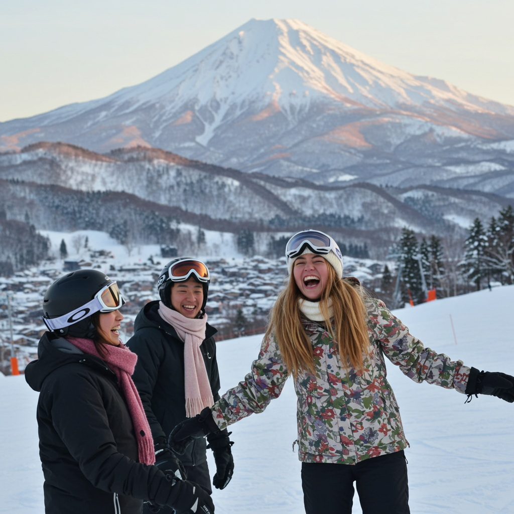

# Theory 2

## 2.1 Ethics
### Background

Models such as GPT-4, Stable Diffusion, and Copilot are impressive in their
ability to generate realistic images but have limitations. These models require
an extensive amount of training data that can be difficult to obtain and may
not fully represent the complexity of the world we live in. Therefore, they may
generate images that are visually convincing but contain inaccuracies or incon-
sistencies with reality.

While these models are undeniably useful for certain purposes, it is essential
to remember that they have limitations. The models should not be solely relied
upon as a complete representation of reality. It is necessary to consider their
constraints and limitations while using them for practical applications. There-
fore, performing a thorough analysis and validation before implementing these
models in real-world scenarios is crucial. By doing so, we can ensure that these
models are helping us to achieve our goals without compromising their reliabil-
ity and accuracy.

Here, you will use any of the generative image LLMs (GPT-4, Copilot, Gem-
ini, etc.) to generate pictures of humans in real-life scenarios. The main goal is
that you asses the images generated (at least 5) and carefully check for incon-
sistencies.

Present your findings (writing) with examples (optional). You should be
able to find one inconsistency with reality and present that, explaining why you
think it happened.

Hint: Check their body composition!

### Answer

|ID|Prompt|Grok|Gemini|
|-|-|-|-|
|1|Generate an image of a small group of friends skiing at niseko village in japan| | |
|2|Generate an image of a family on holiday at nara park in osaka feeding the deer with biscuits during sakura season|||
|3|Generate a person walking down arashiyama bamboo forest using a Fujifilm camera to take a photo|||

|ID|Findings (Grok)|Reasons (Grok) |Findings (Gemini) |Reasons (Gemini)|
|-|-|-|-|-|
|1|Goggle seems to be out of shape for person on the bottom right | Model might not be able to fully grasp how objects should interact in the scene. For instance, if the model is generating a person’s head and accessories like goggles simultaneously, it might generate the goggles with incorrect shapes relative to the head.| Facial muscles looks too exaggerated| Models often struggle with small, subtle details. When trying to render facial features, the model might over-emphasize certain aspects like the jawline, cheeks, or muscles |
|2|Deer on the right has 3 ears and the lady's hand is out of shape |The model might have been trained on images of multiple animals or complex scenes, and it could have confused the deer’s ear for another part of the animal or an overlapping feature. Hands are particularly challenging for generative AI to render accurately, especially when they are in motion or interacting with other objects. | The legs of the group of deer on the right do not align properly with their body poses |While models can generate visual representations, they don’t truly understand animal anatomy. They may not account for the natural movements and relationships between limbs and the body. The legs might not align properly due to the model missing the correct joint angles or body mechanics|
|3| The right ear is missing, and there are irregularities with the fingers, including extra, missing, or incorrectly placed fingers|Human hands are intricate, with many joints and a wide range of natural poses. When holding a camera, fingers may be partially hidden, overlapping, or contorted, making it difficult for the GAN to infer their correct positions|It appears to be quite accurate, though the camera seems slightly larger than usual|If the model was trained on images that didn’t feature the specific object (in this case, the camera) or had variations in size, the model might not have a precise understanding of how the object should appear in context|

