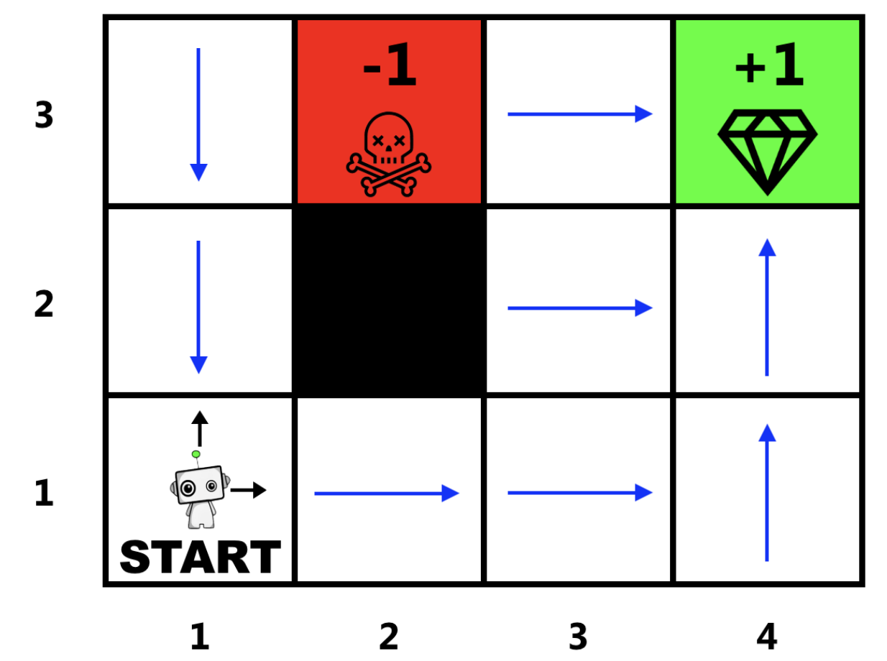

# Theory 4

The goal of this exercise is to introduce you to reinforcement learning (RL) and hopefully by the end of this
lab you have programmed a deep reinforcement learning algorithm that can learn by itself how to play an
Atari game. Below is a brief summary of RL but it is recommended to look at the RL content in the last
module before doing this lab.
Reinforcement learning is learning what to do—how to map situations to actions—so as to maximize a
numerical reward signal. The learner is not told which actions to take, but instead must discover which ac-
tions yield the most reward by trying them. In the most interesting and challenging cases, actions may affect
not only the immediate reward but also the next situation and, through that, all subsequent rewards. These
two characteristics—trial-and-error search and delayed reward—are the two most important distinguishing
features of reinforcement learning [1].

Summary of the reinforcement learning loop:

• Observation: The agent observes the current state of the environment. This can include information
such as sensor readings, raw data, or any other relevant information that represents the current state
of the environment.

• Action: Based on the observed state, the agent selects an action to take. This action is chosen from
the set of possible actions that the agent can take in the current state of the environment. The action
can be deterministic or stochastic, depending on the algorithm and the problem setting.

• Environment: The agent performs the selected action, and the environment transitions to a new state
based on the dynamics of the environment. The environment may also provide the agent with a reward
signal that indicates the immediate feedback on the action taken.

• Reward: The agent receives a reward from the environment, which is a scalar value that reflects the
desirability of the outcome of the action taken. The reward can be positive, negative, or neutral, and
it provides feedback to the agent on how well it is performing

All of these concepts can be modelled by a Markov decision process (MDP) which we will learn more
about in task 1. Most of the strategies for learning in reinforcement learning broadly fit under two categories,
Q-learning and policy gradient methods. Q-learning is a value-based method that estimates the action-value
function and uses the Bellman equation for updates, while policy gradient methods are policy-based methods
that directly optimize the policy using gradient-based optimization. Both methods have their advantages
and disadvantages and are used in different scenarios depending on the characteristics of the problem at
hand. In the practical section we will explore deep Q networks (DQN) further.

## 4.1 GridWorld

This is Gridworld, a simple environment where you can navigate through a grid using four cardinal direc-
tions: North, South, West, and East. Reinforcement learning environments are typically modeled as (MDPs),
which is a mathematical framework used to describe decision-making problems in uncertain environments.
Before we dive into Gridworld, let’s first explore what an MDP is.

A Markov Decision Process (MDP) is defined by:

-   Set of states $S$
-   Set of actions $A$
-   Transition function $P(s'|s,a)$ is the probability of going to $s'$ given the current state $s$ and action $a$
-   Reward function $R(s,a,s')$ returns the reward after taken action $a$ in state $s$ ending up in $s'$
-   Start state $s_0$
-   Discount factor $\gamma$ defines how much we care about immediate reward compared to future reward
-   Horizon H, how long our agent lives
    The goal of a MDP can then be defined by the following equation:

$$
max_{\pi} \mathbb{E} [ \sum_{t=0}^{H} \gamma^t R(S_t, A_t, S_{t+1}) \mid \pi ]
$$

where $\pi$ is our policy. Hence the goal is to find the optimal policy that maximizes our expected reward.

### 4.1.1 Optimal Policy $\pi^*$

A policy $\pi$ is a mapping from state to action. This means that the optimal policy $\pi^∗(s)$ should represent
the best action to take for every possible state.

Assume that gridworld is completely deterministic and draw an arrow(s) in each white cell so that your
solution represents the optimal policy $\pi^∗(s)$.

### 4.1.2 Value Function

A value function in reinforcement learning is a mathematical function that estimates the expected total re-
ward an agent can achieve from a given state, while following a particular policy. It quantifies the desirability
or utility of a state in terms of the rewards the agent can expect to receive over time.

Assume that the transition function is equal to 1, $\gamma$ = 0.9 and $H$ = 100. Calculate the following using
Figure 2 and Eq 2:

$V^*(4,3)$

-   At $t = 0$, choose "up", but max reached so remain at (4,3), $R= +1$
-   From $t = 1$ to $t=99$, repeat and stay at (4,3), $R=+1$
-   Total reward is $1+\gamma+\gamma^2+...+\gamma^{99}$
-   $V^*(4,3) = \frac{1-0.9^{100}}{1-0.9} \approx 10$

$V^*(3,3)$

-   At $t = 0$, choose "right", $R= +1$
-   From $t = 1$ to $t=99$, repeat and stay at (4,3), $R=+1$
-   Total reward is $1+\gamma+\gamma^2+...+\gamma^{99}$
-   $V^*(3,3) = \frac{1-0.9^{100}}{1-0.9} \approx 10$

$V^*(2,3)$

Option 1 — move right to (3,3)

-   At $t = 0$, choose "right", $R=0$
-   At $t = 1$, choose "right", $R=+1$
-   From $t = 2$ to $t=99$, repeat and stay at (4,3), $R=+1$
-   Total reward is $0+\gamma\cdot 1+\gamma^2\cdot 1+...+\gamma^{99}\cdot 1 = \gamma \cdot \frac{1-0.9^{99}}{1-0.9} \approx 0.9 \cdot 10 = 9$

Option 2 — move left to (1,3)

-   At $t = 0$, choose "left", $R=0$
-   7 steps required to reach (4,3)
-   Hence, $\gamma^7 \cdot 10 \approx 0.9^7 \cdot 10 \approx 4.782$

Option 3 — move down to (2,2)

-   At $t = 0$, choose "down", but blocked so remain at (2,3), $R=-1$
-   At $t = 1$, choose "right", $R=0$
-   At $t = 2$, choose "right", $R=+1$
-   From $t = 3$ to $t=99$, repeat and stay at (4,3), $R=+1$
-   Total reward is $-1+\gamma\cdot 0+\gamma^2\cdot 1+...+\gamma^{99}\cdot 1 = -1 + \gamma^2 \cdot \frac{1-0.9^{98}}{1-0.9} \approx -1 + 0.81 \cdot 10 = 7.1$

$V^*(3,1)$

Option 1 — move up to (3,2)

-   At $t = 0$, choose "up", $R=0$
-   At $t = 1$, choose "up", $R=0$
-   At $t = 2$, choose "right", $R=+1$
-   From $t = 3$ to $t=99$, repeat and stay at (4,3), $R=+1$
-   Total reward is $0+\gamma\cdot 0+\gamma^2\cdot 1+\gamma^3\cdot 1+...+\gamma^{99}\cdot 1 = \gamma^2 \cdot \frac{1-0.9^{98}}{1-0.9} \approx 0.81 \cdot 10 = 8.1$

Option 2 — move right to (4,1)

-   At $t = 0$, choose "right", $R=0$
-   At $t = 1$, choose "up", $R=0$
-   At $t = 2$, choose "up", $R=+1$
-   From $t = 3$ to $t=99$, repeat and stay at (4,3), $R=+1$
-   Total reward is $0+\gamma\cdot 0+\gamma^2\cdot 1+\gamma^3\cdot 1+...+\gamma^{99}\cdot 1 = \gamma^2 \cdot \frac{1-0.9^{98}}{1-0.9} \approx 0.81 \cdot 10 = 8.1$

Option 3 — move up and left via (2,3)

-   At $t = 0$, choose "up", $R=0$
-   At $t = 1$, choose "left", $R=-1$
-   At $t = 2$, choose "right", $R=0$
-   At $t = 3$, choose "right", $R=+1$
-   From $t = 4$ to $t=99$, repeat and stay at (4,3), $R=+1$
-   Total reward is $0+\gamma\cdot (-1)+\gamma^2\cdot 0+\gamma^3\cdot 1+...+\gamma^{99}\cdot 1 = -0.9 + \gamma^3 \cdot \frac{1-0.9^{97}}{1-0.9} \approx -0.9 + 0.9^3 \cdot 10 \approx -0.9 + 7.29 = 6.39$

$V^*(1,1)$

Option 1 — move up via (2,3)

-   At $t = 0$, choose "up", $R=0$
-   At $t = 1$, choose "up", $R=0$
-   At $t = 2$, choose "right", $R=-1$
-   At $t = 3$, choose "right", $R=0$
-   At $t = 4$, choose "right", $R=+1$
-   From $t = 5$ to $t=99$, repeat and stay at (4,3), $R=+1$
-   Total reward is $0+\gamma\cdot 0+\gamma^2\cdot (-1)+\gamma^3\cdot 0+\gamma^4\cdot 1+...+\gamma^{99}\cdot 1 = -0.9^2 + \gamma^4 \cdot \frac{1-0.9^{96}}{1-0.9} \approx -0.81 + 0.9^4 \cdot 10 \approx -0.81 + 6.561 = 5.751$

Option 2 — move right to avoid (2,3)

-   At $t = 0$, choose "up", $R=0$
-   At $t = 1$, choose "up", $R=0$
-   At $t = 2$, choose "right", $R=0$
-   At $t = 3$, choose "right", $R=0$
-   At $t = 4$, choose "right", $R=0$
-   At $t = 5$, choose "right", $R=+1$
-   From $t = 6$ to $t=99$, repeat and stay at (4,3), $R=+1$
-   Total reward is $0+\gamma\cdot 0+\gamma^2\cdot 0+\gamma^3\cdot 0+\gamma^4\cdot 0+\gamma^5\cdot 1+...+\gamma^{99}\cdot 1 = \gamma^5 \cdot \frac{1-0.9^{95}}{1-0.9} \approx 0.9^5 \cdot 10 \approx 5.9049$

### 4.1.3 Value Function

Assume that the transition function is equal to 0.8, $\gamma$ = 0.7 and $H$ = 100. Calculate the following using
Figure 2 and Eq 2:

$V^*(4,3)$

-   At $t = 0$, choose "up", but max reached so remain at (4,3), $R= +1$
-   From $t = 1$ to $t=99$, repeat and stay at (4,3), $R=+1$
-   Total reward is $1+\gamma+\gamma^2+...+\gamma^{99}$
-   $V^*(4,3) = \frac{1-0.7^{100}}{1-0.7} \approx 3.333$

$V^*(3,3)$

-   At $t = 0$, choose "right", 0.8 chance to (4,3), $R=+1$, 0.2 chance stay at (3,3), $R=0$
-   From $t = 1$ to $t=99$, if at (4,3), stay at (4,3), $R=+1$; if at (3,3), repeat attempt to (4,3)
-   Total reward accounts for expected discounted steps: $\approx 0.8 \cdot \frac{1}{1 - 0.2 \cdot 0.7} \cdot \frac{1}{1 - 0.7}$
-   $V^*(3,3) \approx 0.9302 \cdot 3.333 \approx 3.101$

## 4.2 Questions

### 4.2.1 Exploration vs Exploitation Problem in RL

The exploration vs exploitation problem refers to the trade-off an agent faces when deciding whether to explore new actions to discover potentially better rewards or exploit known actions that have yielded good rewards in the past. Exploration involves trying new or less-tested actions to gather more information about the environment, which might lead to better long-term strategies. Exploitation involves choosing the action that currently appears optimal based on the agent’s knowledge, maximizing immediate reward. Too much exploration can lead to inefficient learning by wasting time on suboptimal actions, while too much exploitation can cause the agent to miss better strategies, getting stuck in a local optimum

### 4.2.2 Credit-assignment Problem in RL

The credit-assignment problem in RL is the challenge of determining which actions or decisions in a sequence contributed to a received reward, especially when rewards are delayed or sparse. The problem is assigning credit (or blame) to earlier actions that may have set up the conditions for success (or failure). This is complicated by temporal delays and the need to evaluate the impact of each action on long-term outcomes. RL algorithms address this using techniques like temporal-difference learning, where the agent updates value estimates based on future rewards, or eligibility traces, which distribute credit to earlier actions based on their recency and frequency.

To add on, the infamous move 37 in AlphaGo vs. Lee Sedol exemplifies the credit-assignment problem in RL because it was an early move whose value was only realized much later, at the game’s end.

### 4.2.3 Markov Property

The Markov property states that the future state of a process depends only on the current state and action, not on the sequence of prior states or actions.

### 4.2.4 Markov Property in Chess

Chess satisfies the Markov property when considering the game’s state as the current board position. The state of a chess game at any point is fully described by the current board position and associated and the next state and reward depend only on the current state and the action taken, not on the history of prior moves.

### 4.2.5 Difference between Q-learning and Deep Q-learning

-   Q-learning
    -   A tabular, model-free RL algorithm
    -   Stores $Q(s, a)$ values in a table for each state-action pair
    -   Updates using: $Q(s, a) \leftarrow Q(s, a) + \alpha [r + \gamma \max_{a'} Q(s', a') - Q(s, a)]$
    -   Suitable for small, discrete state-action spaces; struggles with large spaces
-   Deep Q-learning (DQN)
    -   Uses a neural network to approximate $Q(s, a; \theta)$
    -   Handles large or continuous state spaces (e.g., image inputs)
    -   Updates via loss: $(r + \gamma \max_{a'} Q(s', a'; \theta_{\text{target}}) - Q(s, a; \theta))^2$
    -   Uses experience replay and target networks for stability
-   Key Difference
    -   Q-learning uses a table, limiting scalability
    -   DQN uses a neural network, enabling complex environments
