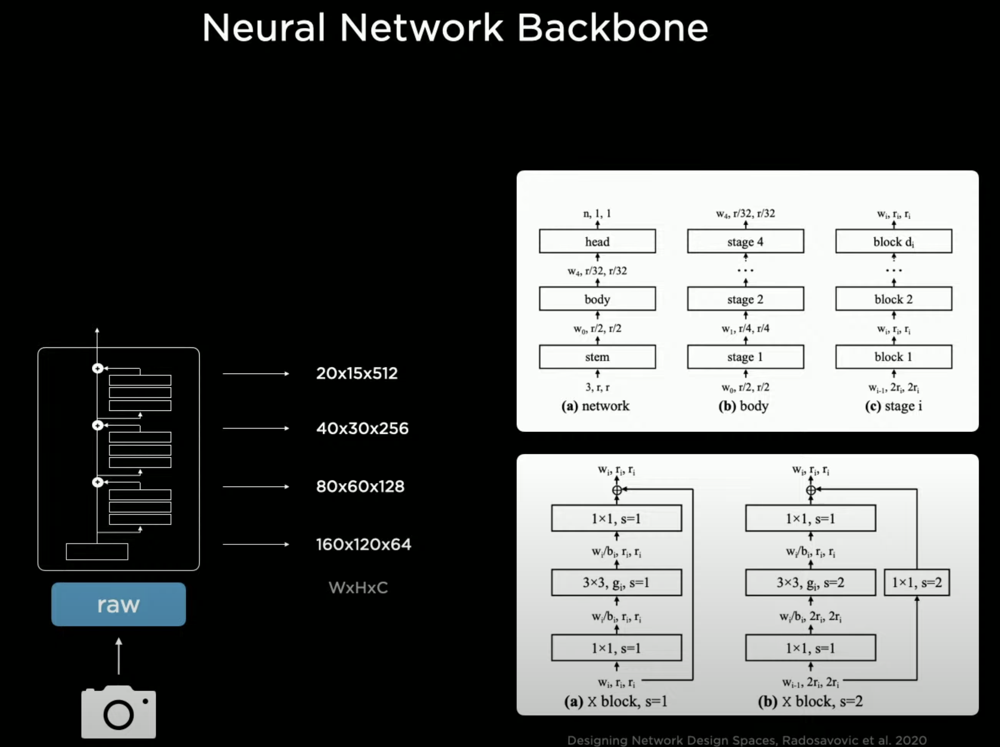
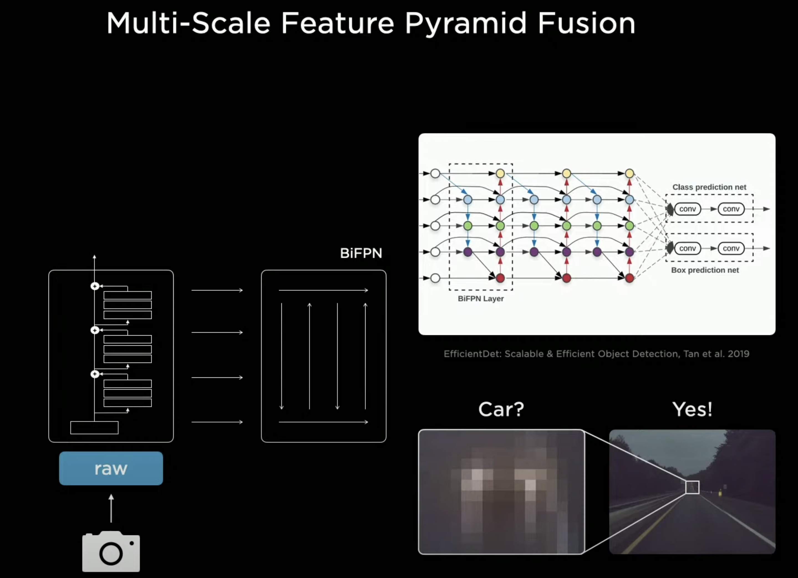
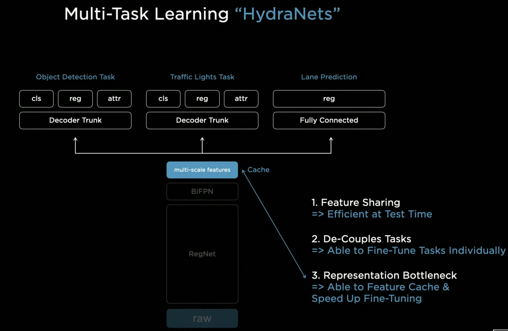
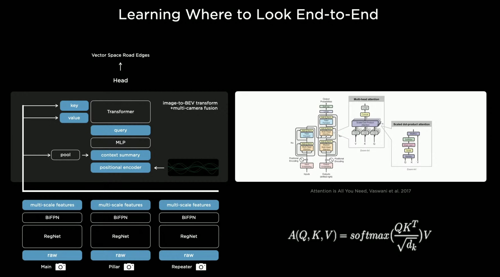

# Report 1

Describe what you have learned during this study period. You can also include references to external material you have used to enhance your learning process (e.g., book chapters, scientific papers, online courses, online sites).

| Task     | Time Spent (hours) |
| -------- | ------------------ |
| Lectures | 2                  |
| Labs     | 4                  |

## Deeper into CNN

Convolutional neural networks (CNN) are specialized neural networks designed to handle data with grid-like structures, such as images and time-series data. They use convolution operations, which combine input data with a small matrix called a kernel to produce feature maps, offering significant efficiency benefits over traditional methods.

| **Term**                    | **Definition**                                                       |
| --------------------------- | -------------------------------------------------------------------- |
| Convolution                 | Linear operation combining input with kernel to produce feature map. |
| Kernel/Filter               | Small matrix slid over input for convolution.                        |
| Feature Map                 | Output of convolution, representing detected features.               |
| Pooling                     | Operation reducing spatial dimensions, e.g., max or average pooling. |
| Sparse Interactions         | Output connects to small input region, reducing computations.        |
| Parameter Sharing           | Same kernel used across input, reducing parameters.                  |
| Equivariant Representations | Outputs transform predictably with input shifts.                     |
| Stride                      | Step size for kernel movement, affecting output size.                |
| Padding                     | Adds zeros around input, handling edge effects in convolution.       |

## Tesla Vision

I’m deeply interested in autonomous vehicles, especially in how Tesla approaches the development of self-driving systems through large-scale data collection, neural network training, and real-world deployment. Tesla’s vision-based strategy—relying on cameras rather than lidar—fascinates me, as it pushes the boundaries of what deep learning can achieve in dynamic, unpredictable environments.

https://www.youtube.com/live/j0z4FweCy4M?feature=shared&t=2928

### Feature Pyramid Network

https://arxiv.org/pdf/1612.03144v2

Feature Pyramid Networks are a cornerstone in modern computer vision, particularly for tasks like object detection where objects appear at varying scales in an image. FPNs address a fundamental challenge: how to efficiently detect objects of different sizes without sacrificing computational efficiency or accuracy. FPNs build on the natural hierarchical structure of convolutional neural networks (CNNs). In a typical CNN, as you move deeper through the layers, the spatial resolution of feature maps decreases (due to pooling or striding), while the semantic richness—information about what objects are—increases. However, shallow layers retain high spatial resolution but lack strong semantic understanding, making it hard to detect small objects using only deep layers or large objects using only shallow layers. FPNs solve this by creating a pyramid of feature maps that combine the best of both worlds.

#### Bottom-Up Pathway

This is the standard forward pass of a CNN (like ResNet), where feature maps are computed at multiple scales. For example, early layers might output high-resolution maps (e.g., 160x120), while deeper layers produce low-resolution maps (e.g., 20x15) with richer semantics.

#### Top-Down Pathway

FPN takes the deepest, most semantically rich feature map and upsamples it (increases its resolution) to match the scale of shallower layers. This process "hallucinates" higher-resolution features with strong semantics.

#### Lateral Connections

At each level, the upsampled features from the top-down pathway are merged with corresponding feature maps from the bottom-up pathway (which have the same spatial size). This fusion is typically done via element-wise addition after a 1x1 convolution to align channel dimensions. The result is a set of feature maps at multiple scales, each with both high resolution and strong semantic content.

### RegNet

https://arxiv.org/pdf/2003.13678

Regular Networks (RegNets) are a family of efficient CNN architectures designed by Facebook AI Research. They aim to optimize the trade-off between accuracy and computational efficiency, making them ideal for resource-constrained environments. The key idea is to create a "regular" network structure where parameters like width (number of channels), depth (number of layers), and resolution are systematically varied and optimized

#### Parameterized Design

RegNets use a template where the network is divided into stages. Each stage has a fixed number of blocks, and parameters like channel width increase linearly or exponentially across stages.

#### Efficiency

RegNets are designed to maximize accuracy per unit of computation (e.g., FLOPs)

## Oral Exam
What is a convolution operation?

What is a full, same and valid kernel?

What is the difference between convolution and correlation?

How does backpropagation work in CNNs?

What is transfer learning and when is it applied?
